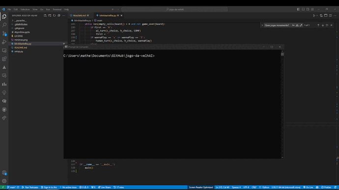
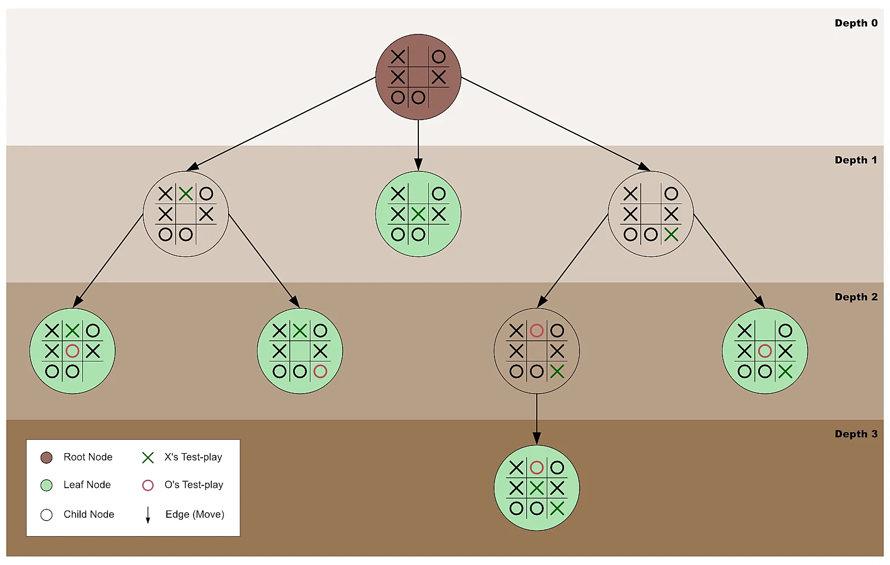

# jogo-da-velhAI
<h2>Jogo da Velha com Algoritmo Minimax</h2>

Este projeto implementa o clássico jogo da velha (Tic-Tac-Toe) com uma inteligência artificial que utiliza o algoritmo Minimax para tomar decisões. O jogo é jogado no terminal entre um jogador humano e o computador.

<h2>Funcionamento</h2>

O objetivo do jogo da velha é alinhar três de suas peças em uma linha horizontal, vertical ou diagonal antes do oponente. No jogo implementado, você pode escolher ser "X" ou "O", e o computador assumirá a outra escolha.

Aqui estão os principais recursos e detalhes de funcionamento do projeto:

<ul>
  <li>O jogador humano pode escolher ser "X" ou "O".</li>
  <li>O computador assume a escolha restante.</li>
  <li>O jogador humano decide se deseja começar primeiro ou não.</li>
  <li>O algoritmo Minimax é usado pelo computador para tomar decisões de jogadas.</li>
  <li>O jogo é renderizado no terminal, e o jogador humano faz suas jogadas usando o teclado numérico (1 a 9).</li>
  <li>O jogo verifica vitórias, derrotas e empates, exibindo mensagens apropriadas.</li>
  <li>O jogador pode optar por jogar novamente após o término de uma partida.</li>
</ul>

<h2>Como Jogar</h2>
<ol>
  <li>Clone o repositório para sua máquina local.</li>
  <li>Execute o arquivo MinMaxVelha.py, utilizando: <b><i>python3 MinMaxVelha.py</i></b></li>
  <li>Escolha ser "X" ou "O" como jogador humano.</li>
  <li>Escolha se deseja começar primeiro ou não.</li>
  <li>Use o teclado numérico para fazer suas jogadas (1 a 9) durante o jogo</li>
  <li>Após o término da partida, você pode optar por jogar novamente.</li>
</ol>

<h2>Implementação do Algoritmo Minimax</h2>

O algoritmo Minimax é utilizado pelo computador para tomar decisões sobre as jogadas. Ele funciona da seguinte forma:

<ul>
  <li>O algoritmo explora todas as possíveis jogadas do jogador humano e do computador, construindo uma árvore de decisão.</li>
  <li>Ele avalia o estado de cada nó da árvore com base em uma função de avaliação.</li>
  <li>O computador escolhe a jogada que maximiza seu valor, enquanto o jogador humano escolhe a jogada que minimiza o valor.</li>
  <li>A Poda Alpha-Beta é implementada para otimizar a busca, eliminando ramos que não afetarão a escolha final.</li>
</ul>
 

 Segue abaixo o funcionamento do algoritmo minmax

<h2>Resumo</h2>

Basicamente ela explora todas as possibilidades de jogadas(na sua respectiva vez de jogar), e vê a melhor posição. 
Para tornar o algoritmo mais eficiente foi utilizado o conceito de poda na busca(pruning the search on backtracking).
O algoritmo é de busca competitiva, isso em IA significa que em jogos mais comuns são aqueles de ambientes determinísticos, 
completamente observáveis em que existem dois agentes cujas ações se alternam e os valores de utilidade são iguais e simétricos.
Por exemplo, se um jogador ganha, recebe +1, o outro que perde recebe -1. 

 Com o algoritmo MinMaxAlfaBeta usamos a busca em que a cada turno um jogador faz sua ação(min ou max) sendo max tentando o maior valor possível para o grau da árvore,
e min tentando o menor possível.

 Dessa forma criamos um jogador "mestre" do qual NÃO É POSSÍVEL VENCER, pois para um jogo pequeno como jogo da velha, ele sempre irá pegar a posição mais favorável no tabuleiro. Logo o melhor resultado que o adversário da IA irá conseguir é o empate

<h3>Não esqueça se gostar de deixar uma estrela no repositório!</h3>
 
  
